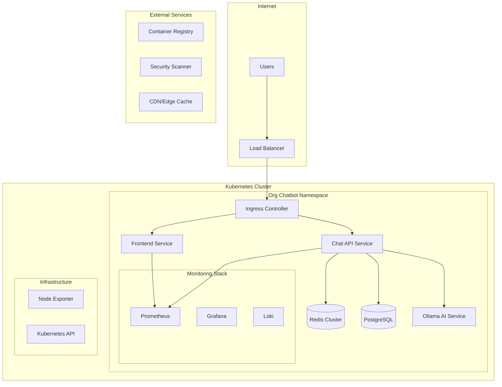
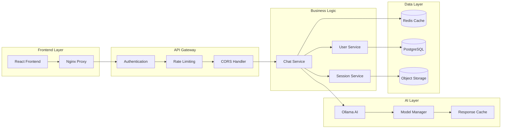
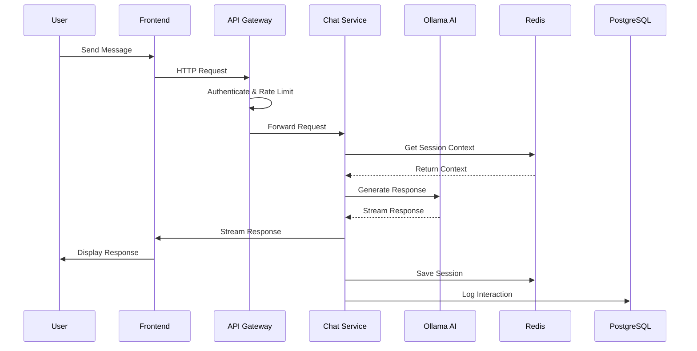

# 🤖 Org Chatbot - Enterprise AI Assistant

<div align="center">


[](https://github.com/username/org-chatbot/actions)
[](https://github.com/username/org-chatbot/security)
[](https://codecov.io/gh/username/org-chatbot)
[](https://opensource.org/licenses/MIT)
[](https://kubernetes.io/)
[](https://www.docker.com/)

**Enterprise-grade AI-powered chatbot with advanced microservices architecture**

[🚀 Quick Start](#-quick-start) • [📖 Documentation](#-documentation) • [🏗️ Architecture](#️-architecture) • [🛠️ Development](#️-development)

</div>

---

## ✨ Features

### 🧠 **Advanced AI Integration**
- **Multiple LLM Support**: Ollama with Llama 3.2, Phi-3, and custom models
- **Intelligent Routing**: Smart model selection based on query complexity
- **Context Awareness**: Persistent conversation memory with Redis
- **Multi-language Support**: Native Hebrew and English support

### 🏗️ **Enterprise Architecture**
- **Microservices**: Scalable, maintainable service architecture
- **Kubernetes Native**: Full container orchestration with auto-scaling
- **High Availability**: Multi-replica deployments with health checks
- **Service Mesh Ready**: Istio integration for advanced traffic management

### 🔒 **Security & Compliance**
- **Zero Trust Security**: Network policies and RBAC
- **Data Encryption**: TLS 1.3 encryption in transit and at rest
- **Audit Logging**: Comprehensive security event logging
- **GDPR Compliant**: Data privacy and protection controls

### 📊 **Observability & Monitoring**
- **Real-time Metrics**: Prometheus + Grafana dashboards
- **Distributed Tracing**: OpenTelemetry integration
- **Log Aggregation**: Centralized logging with Loki
- **Alerting**: Smart alerts for system health and performance

### 🚀 **DevOps Excellence**
- **GitOps Workflow**: Automated deployments with ArgoCD
- **CI/CD Pipeline**: GitHub Actions with security scanning
- **Infrastructure as Code**: Terraform for cloud resources
- **Blue-Green Deployments**: Zero-downtime deployments

---

## 🏗️ Architecture

### High-Level Architecture



### Service Architecture



### Data Flow



---

## 🚀 Quick Start

### Prerequisites

- **Kubernetes Cluster** (v1.24+)
- **kubectl** configured
- **Helm** (v3.0+)
- **Docker** for local development
- **Node.js** (v18+) for frontend development
- **Python** (v3.11+) for backend development

### 🐳 Docker Compose (Development)

```bash
# Clone the repository
git clone https://github.com/username/org-chatbot.git
cd org-chatbot

# Start all services
docker-compose up -d

# Access the application
open http://localhost:3000
```

### ☸️ Kubernetes Deployment

```bash
# Create namespace and apply configurations
kubectl apply -f k8s/namespace.yaml

# Deploy infrastructure services
kubectl apply -f k8s/redis.yaml
kubectl apply -f k8s/postgres.yaml
kubectl apply -f k8s/ollama.yaml

# Deploy application services
kubectl apply -f k8s/chat-api.yaml
kubectl apply -f k8s/frontend.yaml

# Deploy monitoring stack
kubectl apply -f k8s/monitoring.yaml

# Configure ingress and security
kubectl apply -f k8s/ingress.yaml

# Check deployment status
kubectl get pods -n org-chatbot
```

### 🔧 Helm Installation

```bash
# Add Helm repository
helm repo add org-chatbot https://username.github.io/org-chatbot-helm

# Install with custom values
helm install org-chatbot org-chatbot/org-chatbot \
  --namespace org-chatbot \
  --create-namespace \
  --values values-production.yaml
```

---

## 🛠️ Development

### Project Structure

```
org-chatbot/
├── 📁 api/                    # FastAPI backend service
│   ├── 📁 app/               # Application code
│   ├── 📁 tests/             # Unit and integration tests
│   ├── 📁 migrations/        # Database migrations
│   └── 📄 Dockerfile         # Container definition
├── 📁 frontend/              # React frontend application
│   ├── 📁 src/               # Source code
│   ├── 📁 public/            # Static assets
│   └── 📄 Dockerfile         # Container definition
├── 📁 k8s/                   # Kubernetes manifests
│   ├── 📄 namespace.yaml     # Namespace and quotas
│   ├── 📄 redis.yaml         # Redis configuration
│   ├── 📄 postgres.yaml      # PostgreSQL setup
│   ├── 📄 ollama.yaml        # AI service configuration
│   ├── 📄 chat-api.yaml      # API service deployment
│   ├── 📄 frontend.yaml      # Frontend deployment
│   ├── 📄 monitoring.yaml    # Observability stack
│   └── 📄 ingress.yaml       # Ingress and security
├── 📁 .github/               # GitHub Actions workflows
│   └── 📁 workflows/
│       └── 📄 ci-cd.yml      # CI/CD pipeline
├── 📁 docs/                  # Documentation
├── 📁 scripts/               # Utility scripts
└── 📄 docker-compose.yml     # Local development setup
```

### 🔨 Local Development Setup

```bash
# Backend development
cd api
python -m venv venv
source venv/bin/activate  # On Windows: venv\Scripts\activate
pip install -r requirements-dev.txt
uvicorn app.main:app --reload --host 0.0.0.0 --port 8000

# Frontend development
cd frontend
npm install
npm run dev

# Run tests
npm run test:watch        # Frontend tests
pytest --watch           # Backend tests

# Code quality
npm run lint             # Frontend linting
flake8 .                 # Backend linting
black .                  # Code formatting
```

### 🧪 Testing

```bash
# Unit tests
npm test                 # Frontend
pytest                  # Backend

# Integration tests
docker-compose -f docker-compose.test.yml up --abort-on-container-exit

# Performance tests
k6 run tests/performance/load-test.js

# Security tests
trivy fs .              # Vulnerability scanning
bandit -r api/          # Python security linting
```

---

## 📊 Monitoring & Observability

### 📈 Grafana Dashboards

Access comprehensive dashboards at `https://grafana.org-chatbot.com`:

- **System Overview**: CPU, memory, network utilization
- **Application Metrics**: Request rates, response times, error rates
- **AI Performance**: Model inference times, token usage
- **Business Metrics**: User engagement, conversation analytics
- **Infrastructure**: Kubernetes cluster health, resource usage

### 🔍 Logging

```bash
# View application logs
kubectl logs -f deployment/chat-api -n org-chatbot

# Search logs with Loki
curl -G -s "http://loki:3100/loki/api/v1/query_range" \
  --data-urlencode 'query={namespace="org-chatbot"}' \
  --data-urlencode 'start=2023-01-01T00:00:00Z' \
  --data-urlencode 'end=2023-01-01T23:59:59Z'
```

### 🚨 Alerting

Configured alerts for:
- High error rates (>5%)
- Slow response times (>2s)
- Resource exhaustion (>80% CPU/Memory)
- Service unavailability
- Security incidents

---

## 🔒 Security

### 🛡️ Security Features

- **Network Policies**: Restrictive pod-to-pod communication
- **RBAC**: Role-based access control for Kubernetes resources
- **Secrets Management**: Encrypted secrets with external key management
- **Image Scanning**: Automated vulnerability scanning in CI/CD
- **TLS Encryption**: End-to-end encryption for all communications
- **Input Validation**: Comprehensive input sanitization
- **Rate Limiting**: Protection against abuse and DDoS

### 🔐 Security Checklist

- [ ] All images scanned for vulnerabilities
- [ ] Network policies applied
- [ ] RBAC configured
- [ ] Secrets encrypted
- [ ] TLS certificates valid
- [ ] Security headers configured
- [ ] Audit logging enabled
- [ ] Backup encryption enabled

---

## 🚀 Deployment

### 🌍 Production Deployment

```bash
# Deploy to production
kubectl apply -f k8s/ -n org-chatbot

# Verify deployment
kubectl get all -n org-chatbot

# Check ingress
kubectl get ingress -n org-chatbot
```

### 🔄 Blue-Green Deployment

```bash
# Deploy new version
helm upgrade org-chatbot ./helm-chart \
  --set image.tag=v2.0.0 \
  --set strategy.type=blue-green

# Switch traffic
kubectl patch service frontend -p '{"spec":{"selector":{"version":"v2.0.0"}}}'
```

### 📊 Rollback

```bash
# Rollback deployment
kubectl rollout undo deployment/chat-api -n org-chatbot

# Check rollback status
kubectl rollout status deployment/chat-api -n org-chatbot
```

---

## 📚 API Documentation

### 🔗 API Endpoints

| Method | Endpoint | Description | Authentication |
|--------|----------|-------------|----------------|
| `POST` | `/api/chat` | Send message to AI | Bearer Token |
| `GET` | `/api/health` | Health check | None |
| `GET` | `/api/metrics` | Prometheus metrics | None |
| `GET` | `/api/sessions/{id}` | Get session history | Bearer Token |
| `DELETE` | `/api/sessions/{id}` | Delete session | Bearer Token |

### 📖 OpenAPI Specification

Access interactive API documentation at `https://api.org-chatbot.com/docs`

---

## 🤝 Contributing

We welcome contributions! Please see our [Contributing Guide](CONTRIBUTING.md) for details.

### 🐛 Bug Reports

1. Check existing [issues](https://github.com/username/org-chatbot/issues)
2. Create new issue with detailed description
3. Include logs and reproduction steps

### 💡 Feature Requests

1. Discuss in [GitHub Discussions](https://github.com/username/org-chatbot/discussions)
2. Create feature request issue
3. Submit pull request with implementation

---

## 📄 License

This project is licensed under the MIT License - see the [LICENSE](LICENSE) file for details.

---

## 🙏 Acknowledgments

- **Ollama Team** - For the amazing AI model serving platform
- **Kubernetes Community** - For the robust container orchestration
- **FastAPI** - For the high-performance web framework
- **React Team** - For the powerful frontend library
- **Prometheus & Grafana** - For comprehensive monitoring

---

<div align="center">

**Built with ❤️ for the AI-powered future**

[⭐ Star this repo](https://github.com/username/org-chatbot) • [🐛 Report Bug](https://github.com/username/org-chatbot/issues) • [💡 Request Feature](https://github.com/username/org-chatbot/issues)

</div>