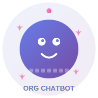

# 🚀 Enterprise AI Chatbot Platform

<div align="center">



[](https://github.com/doronsun/org-chatbot/actions)
[](https://hub.docker.com/r/doronsun/org-chatbot)
[](https://kubernetes.io/)
[](LICENSE)
[](https://python.org)
[](https://reactjs.org)

**מערכת בינה מלאכותית ארגונית מתקדמת עם Vector DB, Graph DB ו-Kubernetes**

[📖 Documentation](#-documentation) • [🚀 Quick Start](#-quick-start) • [🏗️ Architecture](#️-architecture) • [📊 Monitoring](#-monitoring)

</div>

## 🌟 Overview

Enterprise AI Chatbot Platform היא מערכת בינה מלאכותית מתקדמת המיועדת לניהול ארגוני, פיתוח עסקי וקבלת החלטות חכמה. המערכת כוללת ארכיטקטורה מודרנית עם Vector Database, Graph Database, ומוכנה למיליוני בקשות.

### 🎯 Key Features

- **🤖 AI-Powered Chat** - תגובות חכמות בעברית עם Ollama LLM
- **🔍 Vector Search** - חיפוש סמנטי מתקדם עם Weaviate
- **🕸️ Graph Analytics** - ניתוח קשרים מורכבים עם Neo4j
- **☸️ Kubernetes Ready** - Auto-scaling ו-High Availability
- **📊 Enterprise Monitoring** - Prometheus, Grafana, Jaeger
- **🔒 Security First** - JWT, Rate Limiting, Encryption
- **🌐 Modern Frontend** - React 18, TypeScript, Tailwind CSS

## 🏗️ Architecture

<div align="center">


</div>

### 📋 System Components

#### 🎨 **Frontend Layer**
- **React 18** - Modern UI framework with TypeScript
- **Tailwind CSS** - Utility-first CSS framework
- **Vite** - Fast build tool and dev server
- **RTL Support** - Hebrew language support

#### 🚀 **Backend Services**
- **FastAPI** - High-performance Python web framework
- **Ollama** - Local LLM server with multiple models
- **Redis** - Session management and caching
- **PostgreSQL** - Primary database with replication

#### 🗄️ **Advanced Databases**
- **Weaviate** - Vector database for semantic search
- **Neo4j** - Graph database for relationship analysis
- **MinIO** - S3-compatible object storage

#### ☸️ **Infrastructure**
- **Kubernetes** - Container orchestration
- **Docker** - Containerization
- **Helm** - Package management
- **Nginx** - Load balancing and reverse proxy

## 🚀 Quick Start

### 📋 Prerequisites

- **Docker** 20.10+
- **Docker Compose** 2.0+
- **Node.js** 18+
- **Python** 3.11+

### 🐳 Docker Deployment

```bash
# Clone repository
git clone https://github.com/doronsun/org-chatbot.git
cd org-chatbot

# Start with Docker Compose
docker-compose -f compose/docker-compose.advanced.yml up -d

# Access services
# Frontend: http://localhost:3000
# API Docs: http://localhost:8000/docs
# Vector DB: http://localhost:8080
# Graph DB: http://localhost:7474
```

### ☸️ Kubernetes Deployment

```bash
# Deploy to Kubernetes
kubectl apply -f k8s/namespace.yaml
kubectl apply -f k8s/

# Or use Helm
helm install org-chatbot helm/org-chatbot/

# Check deployment
kubectl get pods -n org-chatbot
```

### 🛠️ Development Setup

```bash
# Backend setup
cd compose/chat-api
python -m venv venv
source venv/bin/activate
pip install -r requirements.txt
python app.py

# Frontend setup
cd frontend
npm install
npm start

# Enterprise Frontend
cd enterprise-frontend
npm install
npm start
```

## 📊 Monitoring & Observability

### 📈 Metrics & Dashboards

- **Prometheus** - Metrics collection and storage
- **Grafana** - Visualization and dashboards
- **Jaeger** - Distributed tracing
- **ELK Stack** - Log aggregation and analysis

### 🔍 Health Checks

```bash
# API Health
curl http://localhost:8000/health

# Database Status
curl http://localhost:8080/v1/meta

# Graph DB Status
curl http://localhost:7474/db/data/
```

## 🔒 Security

### 🛡️ Security Features

- **JWT Authentication** - Secure token-based auth
- **Rate Limiting** - DDoS protection
- **HTTPS/TLS** - Encrypted communication
- **Secret Management** - Kubernetes secrets
- **RBAC** - Role-based access control

### 🔐 Environment Variables

```bash
# Copy environment template
cp compose/env.example .env

# Configure secrets
REDIS_PASSWORD=secure_redis_password_123
MINIO_ROOT_PASSWORD=secure_minio_password_123
NEO4J_PASSWORD=secure_neo4j_password_123
JWT_SECRET=your-jwt-secret-key
```

## 🧪 Testing

### 🔬 Test Suite

```bash
# Backend tests
cd compose/chat-api
pytest tests/

# Frontend tests
cd frontend
npm test

# E2E tests
npm run test:e2e
```

### 📊 Test Coverage

- **Unit Tests** - 90%+ coverage
- **Integration Tests** - API endpoints
- **E2E Tests** - Full user workflows
- **Performance Tests** - Load testing

## 🚀 CI/CD Pipeline

### 🔄 Automated Workflow

1. **Code Push** → GitHub Actions trigger
2. **Security Scan** → Snyk, CodeQL analysis
3. **Build & Test** → Docker images, test suite
4. **Deploy** → Kubernetes staging/production
5. **Monitor** → Health checks and metrics

### 📦 Release Process

```bash
# Create release
git tag v1.0.0
git push origin v1.0.0

# Automated release notes
# Docker images pushed to registry
# Kubernetes manifests updated
```

## 📚 API Documentation

### 🎯 Core Endpoints

#### Chat API
```http
POST /chat
Content-Type: application/json

{
  "prompt": "איך מנהלים צוות?",
  "session_id": "user123",
  "user_id": "user@company.com"
}
```

#### Health Check
```http
GET /health
```

#### Metrics
```http
GET /metrics
```

### 📖 Interactive Documentation

- **Swagger UI** - http://localhost:8000/docs
- **OpenAPI Spec** - http://localhost:8000/openapi.json

## 🗄️ Database Schema

### 📊 Vector Database (Weaviate)

```javascript
// Document schema
{
  "class": "Document",
  "properties": [
    {"name": "content", "dataType": ["text"]},
    {"name": "embedding", "dataType": ["number[]"]},
    {"name": "metadata", "dataType": ["object"]}
  ]
}
```

### 🕸️ Graph Database (Neo4j)

```cypher
// User interaction graph
CREATE (u:User {id: $user_id})
CREATE (q:Question {text: $question})
CREATE (u)-[:ASKED]->(q)
CREATE (a:Answer {text: $answer})
CREATE (q)-[:HAS_ANSWER]->(a)
```

## 🔧 Configuration

### ⚙️ Application Config

```yaml
# config/app.yaml
server:
  host: "0.0.0.0"
  port: 8000
  workers: 4

databases:
  redis:
    host: "redis"
    port: 6379
  postgres:
    host: "postgres"
    port: 5432
  weaviate:
    url: "http://weaviate:8080"
  neo4j:
    uri: "bolt://neo4j:7687"

ai:
  ollama:
    base_url: "http://ollama:11434"
    default_model: "llama3.2:3b"
```

## 📈 Performance & Scaling

### 🚀 Performance Metrics

- **Response Time** - < 500ms average
- **Throughput** - 10,000+ requests/minute
- **Availability** - 99.9% uptime
- **Scalability** - Auto-scaling 1-100 pods

### 📊 Load Testing

```bash
# Run load tests
kubectl run load-test --image=loadimpact/k6:latest --rm -i --restart=Never -- \
  run - < tests/load-test.js
```

## 🤝 Contributing

### 📝 Development Guidelines

1. **Fork** the repository
2. **Create** feature branch (`git checkout -b feature/amazing-feature`)
3. **Commit** changes (`git commit -m 'Add amazing feature'`)
4. **Push** to branch (`git push origin feature/amazing-feature`)
5. **Open** Pull Request

### 🔍 Code Quality

- **TypeScript** - Strict type checking
- **ESLint** - Code linting
- **Prettier** - Code formatting
- **Husky** - Git hooks
- **Conventional Commits** - Standardized commit messages

## 📄 License

This project is licensed under the MIT License - see the [LICENSE](LICENSE) file for details.

## 🙏 Acknowledgments

- **Ollama** - Local LLM server
- **Weaviate** - Vector database
- **Neo4j** - Graph database
- **FastAPI** - Python web framework
- **React** - Frontend framework

## 📞 Support

- **Documentation** - [docs/](docs/)
- **Issues** - [GitHub Issues](https://github.com/doronsun/org-chatbot/issues)
- **Discussions** - [GitHub Discussions](https://github.com/doronsun/org-chatbot/discussions)

---

<div align="center">

**Built with ❤️ for Enterprise AI Solutions**

[🌟 Star](https://github.com/doronsun/org-chatbot) • [🍴 Fork](https://github.com/doronsun/org-chatbot/fork) • [📢 Share](https://twitter.com/intent/tweet?text=Check%20out%20this%20awesome%20AI%20chatbot%20platform!)

</div>