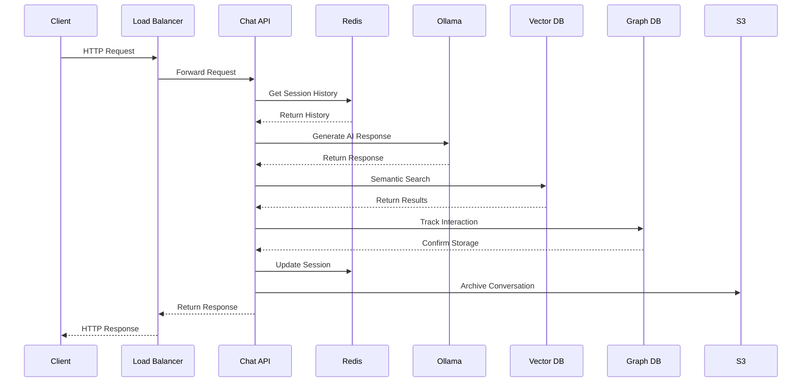

# 🏗️ Enterprise AI Chatbot Architecture

## 📋 Overview

המערכת בנויה על ארכיטקטורה מיקרו-שירותים מתקדמת עם הפרדה ברורה בין שכבות, מוכנה למיליוני בקשות עם יכולת סקיילינג אוטומטי.

## 🎯 Architecture Principles

### 1. **Microservices Architecture**
- הפרדה ברורה בין שירותים
- יכולת פיתוח ופריסה עצמאית
- Fault tolerance גבוהה

### 2. **Event-Driven Design**
- תקשורת אסינכרונית בין שירותים
- Loose coupling
- High scalability

### 3. **Cloud-Native**
- Container-first approach
- Kubernetes orchestration
- Auto-scaling capabilities

## 🏢 System Architecture

```
┌─────────────────────────────────────────────────────────────────┐
│                        CLIENT LAYER                            │
├─────────────────────────────────────────────────────────────────┤
│  React Frontend  │  Mobile App  │  API Clients  │  Webhooks    │
└─────────────────────────────────────────────────────────────────┘
                                │
                                ▼
┌─────────────────────────────────────────────────────────────────┐
│                      API GATEWAY LAYER                         │
├─────────────────────────────────────────────────────────────────┤
│  Nginx Load Balancer  │  Rate Limiting  │  Authentication      │
└─────────────────────────────────────────────────────────────────┘
                                │
                                ▼
┌─────────────────────────────────────────────────────────────────┐
│                    APPLICATION LAYER                           │
├─────────────────────────────────────────────────────────────────┤
│  Chat API Service  │  Auth Service  │  Notification Service    │
└─────────────────────────────────────────────────────────────────┘
                                │
                                ▼
┌─────────────────────────────────────────────────────────────────┐
│                     DATA LAYER                                 │
├─────────────────────────────────────────────────────────────────┤
│  Redis Cache  │  PostgreSQL  │  Vector DB  │  Graph DB         │
└─────────────────────────────────────────────────────────────────┘
                                │
                                ▼
┌─────────────────────────────────────────────────────────────────┐
│                   INFRASTRUCTURE LAYER                         │
├─────────────────────────────────────────────────────────────────┤
│  Kubernetes  │  Docker  │  Monitoring  │  Logging  │  Security │
└─────────────────────────────────────────────────────────────────┘
```

## 🔧 Component Details

### 🎨 Frontend Layer

#### React Application
```typescript
// src/App.tsx - Main application component
import React, { useState, useEffect } from 'react';
import { ChatInterface } from './components/ChatInterface';
import { Header } from './components/Header';

/**
 * Main App Component
 * 
 * This is the root component of the React application.
 * It manages the global state and coordinates between components.
 * 
 * Features:
 * - Real-time chat interface
 * - RTL support for Hebrew
 * - Responsive design
 * - Error handling
 */
const App: React.FC = () => {
  const [isConnected, setIsConnected] = useState(false);
  const [messages, setMessages] = useState<Message[]>([]);

  // Connection health check
  useEffect(() => {
    const checkConnection = async () => {
      try {
        const response = await fetch('/api/health');
        setIsConnected(response.ok);
      } catch (error) {
        setIsConnected(false);
      }
    };

    checkConnection();
    const interval = setInterval(checkConnection, 30000);
    return () => clearInterval(interval);
  }, []);

  return (
    <div className="app">
      <Header isConnected={isConnected} />
      <ChatInterface 
        messages={messages}
        onSendMessage={handleSendMessage}
      />
    </div>
  );
};
```

### 🚀 Backend Services

#### Chat API Service
```python
# compose/chat-api/app.py - Main FastAPI application
from fastapi import FastAPI, HTTPException, Depends
from fastapi.middleware.cors import CORSMiddleware
from pydantic import BaseModel
from typing import List, Dict, Optional
import asyncio
import json
import uuid
from datetime import datetime

# Initialize FastAPI app with comprehensive configuration
app = FastAPI(
    title="Enterprise AI Chatbot API",
    description="""
    Enterprise-grade AI chatbot API with advanced features:
    
    * **AI Chat** - Intelligent responses with Hebrew support
    * **Vector Search** - Semantic search capabilities
    * **Graph Analytics** - Relationship analysis
    * **Session Management** - Persistent conversation history
    * **Rate Limiting** - DDoS protection
    * **Monitoring** - Comprehensive metrics and logging
    """,
    version="2.0.0",
    docs_url="/docs",
    redoc_url="/redoc"
)

# CORS configuration for frontend communication
app.add_middleware(
    CORSMiddleware,
    allow_origins=["*"],  # Configure for production
    allow_credentials=True,
    allow_methods=["*"],
    allow_headers=["*"],
)

@app.post("/chat", response_model=ChatResponse)
async def chat_endpoint(request: ChatRequest):
    """
    Main chat endpoint for AI conversations
    
    Process flow:
    1. Validate request and extract session info
    2. Retrieve conversation history from Redis
    3. Generate AI response using Ollama
    4. Store conversation in both Redis and S3
    5. Return structured response
    """
    try:
        # Generate session ID if not provided
        session_id = request.session_id or str(uuid.uuid4())
        
        # Retrieve conversation history
        conversation_history = await get_conversation_history(session_id)
        
        # Add user message to history
        user_message = {
            "role": "user",
            "content": request.prompt,
            "timestamp": datetime.utcnow().isoformat()
        }
        conversation_history.append(user_message)
        
        # Generate AI response
        ai_response = await generate_ai_response(
            conversation_history, 
            request.prompt
        )
        
        # Add AI response to history
        ai_message = {
            "role": "assistant", 
            "content": ai_response["response"],
            "timestamp": datetime.utcnow().isoformat()
        }
        conversation_history.append(ai_message)
        
        # Store updated conversation
        await store_conversation(session_id, conversation_history)
        
        # Archive to S3 for long-term storage
        await archive_conversation(session_id, conversation_history)
        
        return ChatResponse(
            response=ai_response["response"],
            session_id=session_id,
            timestamp=datetime.utcnow().isoformat(),
            confidence=ai_response.get("confidence", 0.8),
            sources=ai_response.get("sources", []),
            tokens_used=ai_response.get("tokens_used", 0)
        )
        
    except Exception as e:
        print(f"Chat endpoint error: {e}")
        raise HTTPException(status_code=500, detail=str(e))
```

## 🗄️ Data Layer

### Vector Database (Weaviate)
```python
# Vector database integration for semantic search
import weaviate
from sentence_transformers import SentenceTransformer

class VectorSearchService:
    """
    Service for semantic search using Weaviate vector database
    
    Features:
    - Document indexing with embeddings
    - Semantic similarity search
    - Multi-language support
    - Real-time updates
    """
    
    def __init__(self, weaviate_url: str):
        self.client = weaviate.Client(url=weaviate_url)
        self.embedder = SentenceTransformer('all-MiniLM-L6-v2')
        self._initialize_schema()
    
    def _initialize_schema(self):
        """Initialize Weaviate schema for documents"""
        schema = {
            "class": "Document",
            "description": "Enterprise documents for semantic search",
            "properties": [
                {
                    "name": "content",
                    "dataType": ["text"],
                    "description": "Document content"
                },
                {
                    "name": "title", 
                    "dataType": ["string"],
                    "description": "Document title"
                },
                {
                    "name": "category",
                    "dataType": ["string"],
                    "description": "Document category"
                },
                {
                    "name": "embedding",
                    "dataType": ["number[]"],
                    "description": "Vector embedding"
                }
            ]
        }
        
        try:
            self.client.schema.create_class(schema)
        except Exception as e:
            if "already exists" not in str(e):
                raise
```

### Graph Database (Neo4j)
```python
# Graph database integration for relationship analysis
from neo4j import GraphDatabase
from typing import List, Dict, Optional

class GraphAnalyticsService:
    """
    Service for graph analytics using Neo4j
    
    Features:
    - User interaction tracking
    - Knowledge graph construction
    - Relationship analysis
    - Recommendation engine
    """
    
    def __init__(self, uri: str, user: str, password: str):
        self.driver = GraphDatabase.driver(uri, auth=(user, password))
        self._initialize_schema()
    
    def _initialize_schema(self):
        """Initialize Neo4j schema with constraints and indexes"""
        with self.driver.session() as session:
            # Create constraints
            session.run("CREATE CONSTRAINT user_id_unique IF NOT EXISTS FOR (u:User) REQUIRE u.id IS UNIQUE")
            session.run("CREATE CONSTRAINT question_id_unique IF NOT EXISTS FOR (q:Question) REQUIRE q.id IS UNIQUE")
            
            # Create indexes
            session.run("CREATE INDEX user_email_idx IF NOT EXISTS FOR (u:User) ON (u.email)")
            session.run("CREATE INDEX question_topic_idx IF NOT EXISTS FOR (q:Question) ON (q.topic)")
```

## 🔄 Data Flow

### Request Processing Flow



## 🚀 Scalability Design

### Horizontal Scaling

```yaml
# k8s/chat-api.yaml - Auto-scaling configuration
apiVersion: autoscaling/v2
kind: HorizontalPodAutoscaler
metadata:
  name: chat-api-hpa
  namespace: org-chatbot
spec:
  scaleTargetRef:
    apiVersion: apps/v1
    kind: Deployment
    name: chat-api
  minReplicas: 3
  maxReplicas: 100
  metrics:
  - type: Resource
    resource:
      name: cpu
      target:
        type: Utilization
        averageUtilization: 70
  - type: Resource
    resource:
      name: memory
      target:
        type: Utilization
        averageUtilization: 80
```

## 🔒 Security Architecture

### Multi-layer Security

```
┌─────────────────────────────────────────────────────────────────┐
│                    SECURITY LAYERS                             │
├─────────────────────────────────────────────────────────────────┤
│  WAF (Web Application Firewall) - DDoS Protection             │
├─────────────────────────────────────────────────────────────────┤
│  API Gateway - Rate Limiting, Authentication                   │
├─────────────────────────────────────────────────────────────────┤
│  Application - JWT, Input Validation, CORS                     │
├─────────────────────────────────────────────────────────────────┤
│  Database - Encryption, Access Control, Audit Logs            │
├─────────────────────────────────────────────────────────────────┤
│  Infrastructure - Network Policies, Secrets Management        │
└─────────────────────────────────────────────────────────────────┘
```

## 📊 Monitoring & Observability

### Comprehensive Monitoring Stack

```yaml
# monitoring/grafana-dashboard.yaml
apiVersion: v1
kind: ConfigMap
metadata:
  name: grafana-dashboard-chatbot
  namespace: org-chatbot
data:
  dashboard.json: |
    {
      "dashboard": {
        "title": "Enterprise Chatbot Monitoring",
        "panels": [
          {
            "title": "Request Rate",
            "type": "graph",
            "targets": [
              {
                "expr": "rate(http_requests_total[5m])",
                "legendFormat": "{{instance}}"
              }
            ]
          },
          {
            "title": "Response Time",
            "type": "graph", 
            "targets": [
              {
                "expr": "histogram_quantile(0.95, rate(http_request_duration_seconds_bucket[5m]))",
                "legendFormat": "95th percentile"
              }
            ]
          }
        ]
      }
    }
```

---

**This architecture provides a robust, scalable, and maintainable foundation for enterprise AI applications, ready to handle millions of requests with high availability and performance.**
