# 🏗️ Architecture Diagrams

## System Overview

```mermaid
graph TB
    subgraph "🌐 Internet"
        U[👥 Users]
        CDN[🌍 CDN/Edge Cache]
    end
    
    subgraph "☁️ Cloud Provider"
        LB[⚖️ Load Balancer]
        WAF[🛡️ Web Application Firewall]
        
        subgraph "☸️ Kubernetes Cluster"
            ING[🚪 Ingress Controller]
            
            subgraph "🏢 Org Chatbot Namespace"
                subgraph "🎨 Frontend Layer"
                    FE[⚛️ React Frontend]
                    NGINX[🌐 Nginx Proxy]
                end
                
                subgraph "🔌 API Gateway"
                    AUTH[🔐 Authentication]
                    RATE[⏱️ Rate Limiting]
                    CORS[🌐 CORS Handler]
                end
                
                subgraph "🧠 Business Logic"
                    CHAT[💬 Chat Service]
                    USER[👤 User Service]
                    SESSION[📝 Session Service]
                end
                
                subgraph "🤖 AI Layer"
                    OLLAMA[🧠 Ollama AI]
                    MODELS[📚 Model Manager]
                    CACHE[⚡ Response Cache]
                end
                
                subgraph "💾 Data Layer"
                    REDIS[(🔴 Redis Cache)]
                    PG[(🐘 PostgreSQL)]
                    S3[(📦 Object Storage)]
                end
                
                subgraph "📊 Monitoring Stack"
                    PROM[📈 Prometheus]
                    GRAF[📊 Grafana]
                    LOKI[📝 Loki]
                    JAEGER[🔍 Jaeger]
                end
            end
            
            subgraph "🔧 Infrastructure"
                NODE[🖥️ Node Exporter]
                KUBE[☸️ Kubernetes API]
                ISTIO[🕸️ Istio Service Mesh]
            end
        end
    end
    
    subgraph "🔒 External Services"
        REG[📦 Container Registry]
        SEC[🔍 Security Scanner]
        KEY[🔑 Key Management]
    end
    
    %% User Flow
    U --> CDN
    CDN --> LB
    LB --> WAF
    WAF --> ING
    ING --> FE
    
    %% Frontend to API
    FE --> NGINX
    NGINX --> AUTH
    AUTH --> RATE
    RATE --> CORS
    CORS --> CHAT
    
    %% Business Logic
    CHAT --> USER
    CHAT --> SESSION
    CHAT --> OLLAMA
    
    %% AI Processing
    OLLAMA --> MODELS
    MODELS --> CACHE
    
    %% Data Storage
    CHAT --> REDIS
    USER --> PG
    SESSION --> S3
    
    %% Monitoring
    CHAT --> PROM
    FE --> PROM
    PROM --> GRAF
    PROM --> LOKI
    
    %% Infrastructure
    NODE --> PROM
    KUBE --> PROM
    ISTIO --> CHAT
    ISTIO --> FE
    
    %% External Integrations
    REG --> FE
    REG --> CHAT
    SEC --> REG
    KEY --> AUTH
```

## Data Flow Architecture

```mermaid
sequenceDiagram
    participant U as 👥 User
    participant CDN as 🌍 CDN
    participant LB as ⚖️ Load Balancer
    participant FE as ⚛️ Frontend
    participant API as 🔌 API Gateway
    participant CHAT as 💬 Chat Service
    participant AI as 🤖 Ollama AI
    participant REDIS as 🔴 Redis
    participant PG as 🐘 PostgreSQL
    participant MON as 📊 Monitoring
    
    Note over U,MON: 🚀 User Request Flow
    
    U->>CDN: 📱 Send Message
    CDN->>LB: 🔄 Route Request
    LB->>FE: 📡 HTTPS Request
    FE->>API: 🔐 Authenticated Request
    
    Note over API,CHAT: 🔒 Security & Validation
    
    API->>API: 🔍 Rate Limiting
    API->>API: 🛡️ Input Validation
    API->>CHAT: ➡️ Forward Request
    
    Note over CHAT,AI: 🧠 AI Processing
    
    CHAT->>REDIS: 📖 Get Session Context
    REDIS-->>CHAT: 📋 Return Context
    CHAT->>AI: 🤖 Generate Response
    AI-->>CHAT: 📝 Stream Response
    CHAT->>FE: 📡 Stream to User
    FE->>U: 💬 Display Response
    
    Note over CHAT,PG: 💾 Data Persistence
    
    CHAT->>REDIS: 💾 Save Session
    CHAT->>PG: 📊 Log Interaction
    CHAT->>MON: 📈 Send Metrics
    
    Note over U,MON: ✅ Request Complete
```

## Microservices Architecture

```mermaid
graph LR
    subgraph "🎨 Frontend Services"
        WEB[🌐 Web App]
        MOBILE[📱 Mobile App]
        ADMIN[👨‍💼 Admin Panel]
    end
    
    subgraph "🔌 API Gateway"
        GATEWAY[🚪 API Gateway]
        AUTH[🔐 Auth Service]
        RATE[⏱️ Rate Limiter]
    end
    
    subgraph "💬 Core Services"
        CHAT[💬 Chat Service]
        USER[👤 User Service]
        SESSION[📝 Session Service]
        NOTIFY[🔔 Notification Service]
    end
    
    subgraph "🤖 AI Services"
        OLLAMA[🧠 Ollama Service]
        MODEL[📚 Model Manager]
        CACHE[⚡ AI Cache]
        TRAIN[🎓 Training Service]
    end
    
    subgraph "💾 Data Services"
        REDIS[(🔴 Redis)]
        PG[(🐘 PostgreSQL)]
        S3[(📦 S3 Storage)]
        ES[(🔍 Elasticsearch)]
    end
    
    subgraph "📊 Observability"
        PROM[📈 Prometheus]
        GRAF[📊 Grafana]
        LOKI[📝 Loki]
        JAEGER[🔍 Jaeger]
    end
    
    %% Frontend to Gateway
    WEB --> GATEWAY
    MOBILE --> GATEWAY
    ADMIN --> GATEWAY
    
    %% Gateway to Services
    GATEWAY --> AUTH
    GATEWAY --> RATE
    GATEWAY --> CHAT
    GATEWAY --> USER
    
    %% Service Communication
    CHAT --> USER
    CHAT --> SESSION
    CHAT --> OLLAMA
    CHAT --> NOTIFY
    
    %% AI Services
    OLLAMA --> MODEL
    MODEL --> CACHE
    OLLAMA --> TRAIN
    
    %% Data Layer
    CHAT --> REDIS
    USER --> PG
    SESSION --> S3
    CHAT --> ES
    
    %% Monitoring
    CHAT --> PROM
    USER --> PROM
    OLLAMA --> PROM
    PROM --> GRAF
    PROM --> LOKI
    CHAT --> JAEGER
```

## Security Architecture

```mermaid
graph TB
    subgraph "🌐 External Layer"
        INTERNET[🌍 Internet]
        WAF[🛡️ Web Application Firewall]
        CDN[🌍 Content Delivery Network]
    end
    
    subgraph "☸️ Kubernetes Security"
        ING[🚪 Ingress Controller]
        NP[🛡️ Network Policies]
        RBAC[👤 RBAC]
        PSP[🔒 Pod Security Policies]
    end
    
    subgraph "🔐 Application Security"
        TLS[🔒 TLS Encryption]
        JWT[🎫 JWT Tokens]
        OIDC[🔑 OIDC/OAuth2]
        SECRETS[🗝️ Secrets Management]
    end
    
    subgraph "💾 Data Security"
        ENCRYPT[🔐 Encryption at Rest]
        BACKUP[💾 Encrypted Backups]
        AUDIT[📋 Audit Logging]
        DLP[🔍 Data Loss Prevention]
    end
    
    subgraph "🔍 Security Monitoring"
        SIEM[🚨 Security Information]
        SOC[👁️ Security Operations]
        THREAT[🛡️ Threat Detection]
        INCIDENT[🚨 Incident Response]
    end
    
    %% Security Flow
    INTERNET --> WAF
    WAF --> CDN
    CDN --> ING
    
    %% Kubernetes Security
    ING --> NP
    NP --> RBAC
    RBAC --> PSP
    
    %% Application Security
    PSP --> TLS
    TLS --> JWT
    JWT --> OIDC
    OIDC --> SECRETS
    
    %% Data Security
    SECRETS --> ENCRYPT
    ENCRYPT --> BACKUP
    BACKUP --> AUDIT
    AUDIT --> DLP
    
    %% Security Monitoring
    DLP --> SIEM
    SIEM --> SOC
    SOC --> THREAT
    THREAT --> INCIDENT
```

## Deployment Pipeline

```mermaid
graph LR
    subgraph "👨‍💻 Development"
        DEV[💻 Developer]
        IDE[🛠️ IDE/Editor]
        GIT[📝 Git Repository]
    end
    
    subgraph "🔄 CI/CD Pipeline"
        TRIGGER[🚀 GitHub Actions]
        BUILD[🔨 Build Images]
        TEST[🧪 Run Tests]
        SCAN[🔍 Security Scan]
        DEPLOY[🚀 Deploy]
    end
    
    subgraph "☸️ Kubernetes"
        DEV_ENV[🧪 Development]
        STAGING[🎭 Staging]
        PROD[🚀 Production]
    end
    
    subgraph "📊 Monitoring"
        HEALTH[💚 Health Checks]
        METRICS[📈 Metrics]
        ALERTS[🚨 Alerts]
        ROLLBACK[↩️ Rollback]
    end
    
    %% Development Flow
    DEV --> IDE
    IDE --> GIT
    GIT --> TRIGGER
    
    %% CI/CD Flow
    TRIGGER --> BUILD
    BUILD --> TEST
    TEST --> SCAN
    SCAN --> DEPLOY
    
    %% Deployment Flow
    DEPLOY --> DEV_ENV
    DEPLOY --> STAGING
    DEPLOY --> PROD
    
    %% Monitoring Flow
    PROD --> HEALTH
    HEALTH --> METRICS
    METRICS --> ALERTS
    ALERTS --> ROLLBACK
    ROLLBACK --> PROD
```

## Scalability Architecture

```mermaid
graph TB
    subgraph "📊 Load Balancing"
        ALB[⚖️ Application Load Balancer]
        HPA[📈 Horizontal Pod Autoscaler]
        VPA[📊 Vertical Pod Autoscaler]
    end
    
    subgraph "☸️ Kubernetes Scaling"
        NODES[🖥️ Worker Nodes]
        PODS[📦 Pod Replicas]
        SERVICES[🔌 Service Mesh]
    end
    
    subgraph "💾 Data Scaling"
        REDIS_CLUSTER[🔴 Redis Cluster]
        PG_REPLICA[🐘 PostgreSQL Replicas]
        SHARDING[📊 Data Sharding]
    end
    
    subgraph "🤖 AI Scaling"
        MODEL_REPLICAS[🧠 Model Replicas]
        GPU_NODES[🎮 GPU Nodes]
        INFERENCE_CACHE[⚡ Inference Cache]
    end
    
    subgraph "📈 Performance"
        CDN[🌍 Global CDN]
        CACHE[⚡ Multi-level Cache]
        QUEUE[📋 Message Queues]
    end
    
    %% Scaling Flow
    ALB --> HPA
    HPA --> VPA
    VPA --> NODES
    
    %% Kubernetes Scaling
    NODES --> PODS
    PODS --> SERVICES
    
    %% Data Scaling
    SERVICES --> REDIS_CLUSTER
    SERVICES --> PG_REPLICA
    PG_REPLICA --> SHARDING
    
    %% AI Scaling
    SERVICES --> MODEL_REPLICAS
    MODEL_REPLICAS --> GPU_NODES
    GPU_NODES --> INFERENCE_CACHE
    
    %% Performance
    INFERENCE_CACHE --> CDN
    CDN --> CACHE
    CACHE --> QUEUE
```

## Disaster Recovery

```mermaid
graph TB
    subgraph "🌍 Primary Region"
        PRIMARY[☸️ Primary Cluster]
        PRIMARY_DATA[💾 Primary Data]
        PRIMARY_BACKUP[💾 Local Backup]
    end
    
    subgraph "🌍 Secondary Region"
        SECONDARY[☸️ Secondary Cluster]
        SECONDARY_DATA[💾 Secondary Data]
        REPLICA[🔄 Data Replication]
    end
    
    subgraph "☁️ Cloud Storage"
        S3_BACKUP[📦 S3 Backup]
        GLACIER[🧊 Glacier Archive]
        CROSS_REGION[🌍 Cross-Region Replication]
    end
    
    subgraph "🔄 Recovery Process"
        DETECT[🚨 Failure Detection]
        FAILOVER[🔄 Failover]
        RESTORE[🔄 Restore]
        VERIFY[✅ Verification]
    end
    
    %% Primary Operations
    PRIMARY --> PRIMARY_DATA
    PRIMARY_DATA --> PRIMARY_BACKUP
    
    %% Replication
    PRIMARY_DATA --> REPLICA
    REPLICA --> SECONDARY_DATA
    SECONDARY_DATA --> SECONDARY
    
    %% Backup Strategy
    PRIMARY_BACKUP --> S3_BACKUP
    S3_BACKUP --> GLACIER
    S3_BACKUP --> CROSS_REGION
    
    %% Recovery Flow
    DETECT --> FAILOVER
    FAILOVER --> SECONDARY
    SECONDARY --> RESTORE
    RESTORE --> VERIFY
    VERIFY --> PRIMARY
```

